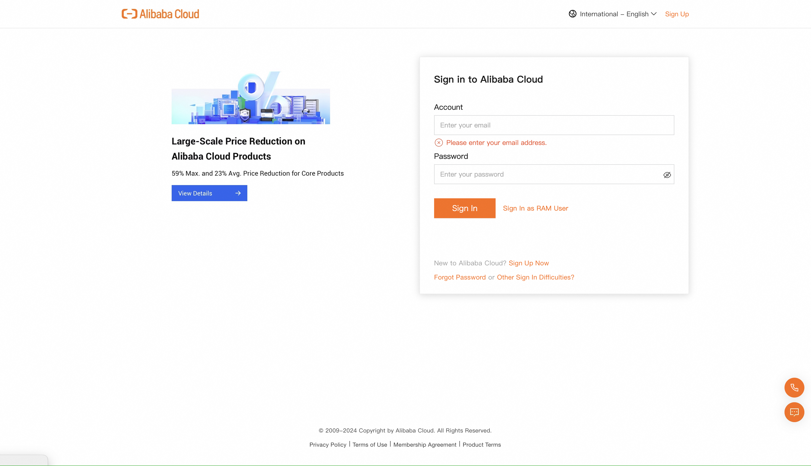
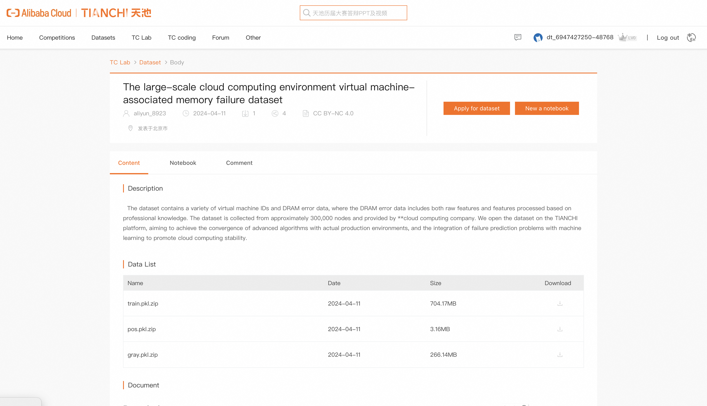
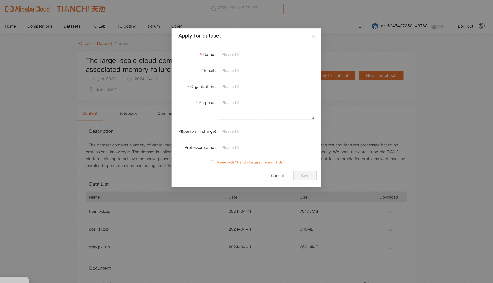

DCRV Prediction Source Code and User Manual
---
## Code Download
Execute the following commands to download the repository:
```python print
git clone https://github.com/num-sc/DCRV-Prediction
```
---
## Dataset Download
This paper releases a large preprocessed dataset for DCRV prediction. To access the dataset, please click the 'Apply for dataset' button on the webpage:
```python print
https://tianchi.aliyun.com/dataset/175133?lang=en-us
```
The download steps are as follows:



When we receive your application, a confirmation email will be sent to the email address you provided, after which you can proceed with the download.

---
## Dependency
The experiments are conducted with packages in the following versions:
```python print
python == 3.9.18 
numpy == 1.26.0 
xgboost == 2.0.2
pandas == 2.1.1 
scikit-learn == 1.3.2
joblib == 1.3.2 
matplotlib == 3.8.2 
pytorch == 1.12.1 
conda == 23.9.0 
```
We recommend using a virtual environment management tool 'conda', which handles dependencies between packages and libraries. The installation method is available at: https://conda.io/projects/conda/en/latest/user-guide/install/index.html

---
## Hardware
In this paper, experiments are conducted on two local dedicated servers. Each server is equipped with 
```python print
Intel(R) Xeon(R) Platinum 8269CY CPU @ 2.50GHz
370GB Memory
500GB SSD
8 Tesla V100 GPU
```
Note: The different server configurations may result in varying times required to reproduce the results.

---
## Runtime configuration
1. Download the dataset zip file and extract to directory.
2. Copy the file path to the config/file_path_config.py file.
```python print
train_dataset_path='/path/to/file'
gray_dataset_path='/path/to/file'
pos_dataset_path='/path/to/file'
```
3. Set the program root directory in the config/file_path_config.py file.
```python print
base_path = '/path/to/project/'
```

---
## Execution
The primary workflow  includes dataset downloading, model training, grayscale testing, and result output.
1. Prepare datasets.
2. Execute scripts for model training.
```python print
cd /path/to/model_comparision
python logistic_regression.py
python random_forest.py
python xgboost_model.py
python xgboost_model_seed_80.py
```
Expected Reproduction Time (in Minutes)
```python print
logistic_regression.py    360
random_forest.py          120
xgboost_model.py          150
xgboost_model_seed_80.py  30
```
Expected Results
```python print
......
......
2024-04-07 10:32:40,477 *****.py __main__ <module> 293 INFO seed value: *
2024-04-07 10:32:40,477 *****.py __main__ <module> 294 INFO max_depth: 30
2024-04-07 10:32:40,477 *****.py __main__ main_train 44 INFO *** training
......
......
2024-04-07 10:33:52,645 *****.py __main__ main_test 96 INFO ---------------------------------------------------------------
2024-04-07 10:33:52,645 *****.py __main__ main_test 97 INFO nc ip threshold is: 0.6
2024-04-07 10:33:53,553 *****.py __main__ test_metric 67 INFO nc_ip Test Accuracy:0.8164173069146785
2024-04-07 10:33:53,554 *****.py __main__ test_metric 68 INFO nc_ip Test Precision:0.23863636363636365
2024-04-07 10:33:53,554 *****.py __main__ test_metric 69 INFO nc_ip Test Recall:0.46875
2024-04-07 10:33:53,554 *****.py __main__ test_metric 70 INFO nc_ip Test F1 Score:0.31626506024096385
......
......
2024-04-07 10:34:18,611 *****.py __main__ main_test 108 INFO ---------------------------------------------------------------
2024-04-07 10:34:18,611 *****.py __main__ main_test 109 INFO vm id threshold is: 0.6
2024-04-07 10:34:20,022 *****.py __main__ test_metric 67 INFO instance_id Test Accuracy:0.8590770931196463
2024-04-07 10:34:20,022 *****.py __main__ test_metric 68 INFO instance_id Test Precision:0.21169354838709678
2024-04-07 10:34:20,022 *****.py __main__ test_metric 69 INFO instance_id Test Recall:0.46875
2024-04-07 10:34:20,022 *****.py __main__ test_metric 70 INFO instance_id Test F1 Score:0.2916666666666667
......
......
```
Note:
- 'nc ip' means that the current prediction unit
is node. 
- 'instance_id' means that the current prediction unit
is VM. 
- 'threshold' means that the value of decision
threshold.
- metrics shown in the standard output are not equal to the average of 100 iterations.

3. Execute scripts for grayscale testing.
```python print
cd /path/to/grayscale_testing
python xgboost_model.py
```
Expected Reproduction Time (in Minutes)
```python print
xgboost_model.py          60
```
Expected Results
```python print
......
......
2024-04-18 10:40:48,356 __main__ <module> 128 INFO First: VM Migration
......
......
2024-04-18 10:40:52,265 __main__ main_test 99 INFO nc ip threshold is: 0.72
2024-04-18 10:40:57,240 __main__ test_metric 63 INFO nc_ip Test Accuracy:0.8674281052416888
2024-04-18 10:40:57,240 __main__ test_metric 64 INFO nc_ip Test Precision:0.2556390977443609
2024-04-18 10:40:57,240 __main__ test_metric 65 INFO nc_ip Test Recall:0.5230769230769231
2024-04-18 10:40:57,240 __main__ test_metric 66 INFO nc_ip Test F1 Score:0.3434343434343434
......
2024-04-18 10:40:57,240 __main__ main_test 114 INFO vm id threshold is: 0.4
2024-04-18 10:41:02,198 __main__ test_metric 63 INFO instance_id Test Accuracy:0.045075125208681135
2024-04-18 10:41:02,198 __main__ test_metric 64 INFO instance_id Test Precision:0.045075125208681135
2024-04-18 10:41:02,198 __main__ test_metric 65 INFO instance_id Test Recall:1.0
2024-04-18 10:41:02,198 __main__ test_metric 66 INFO instance_id Test F1 Score:0.08626198083067092
......
2024-04-18 10:41:02,211 __main__ <module> 142 INFO Second: VM Migration
......
......
2024-04-18 10:41:03,979 __main__ main_test 99 INFO nc ip threshold is: 0.72
2024-04-18 10:41:04,844 __main__ test_metric 63 INFO nc_ip Test Accuracy:0.8465553235908142
2024-04-18 10:41:04,844 __main__ test_metric 64 INFO nc_ip Test Precision:0.027210884353741496
2024-04-18 10:41:04,845 __main__ test_metric 65 INFO nc_ip Test Recall:0.5
2024-04-18 10:41:04,845 __main__ test_metric 66 INFO nc_ip Test F1 Score:0.051612903225806445
......
2024-04-18 10:41:04,845 __main__ main_test 114 INFO vm id threshold is: 0.8
2024-04-18 10:41:05,984 __main__ test_metric 63 INFO instance_id Test Accuracy:0.9704476314645806
2024-04-18 10:41:05,984 __main__ test_metric 64 INFO instance_id Test Precision:0.016129032258064516
2024-04-18 10:41:05,984 __main__ test_metric 65 INFO instance_id Test Recall:0.125
2024-04-18 10:41:05,984 __main__ test_metric 66 INFO instance_id Test F1 Score:0.028571428571428574......
......
```
---
4. Execute scripts to generate profiling results and figures
```python print
cd /path/to/results_analysis
python figure_7a_precision_recall_vm.py
python figure_7b_loss_time.py
python figure_8a_cost_nc_vm.py
python figure_8b_cost_hybrid_mixture.py
python figure_9a_leading_time.py
python figure_9b_sensitivity.py
python figure_10_feature_importance.py
python table_5_rf_avg_test_result.py
python table_5_xgb_avg_test_result.py
python table_6_grayscale.py
```
Expected Reproduction Time (in Minutes)
```python print
figure_7a_precision_recall_vm.py    1
figure_7b_loss_time.py              1
figure_8a_cost_nc_vm.py             1
figure_8b_cost_hybrid_mixture.py    1
figure_9a_leading_time.py           1
figure_9b_sensitivity.py            1
figure_10_feature_importance.py     1
table_5_rf_avg_test_result.py       5
table_5_xgb_avg_test_result.py      5
table_6_grayscale.py                5
```
Expected Results:
after executing the above command, please check the output
results in the command line or in the /path/to/figure/ directory.
```python print
    figure_7a.pdf
    figure_7b.pdf
    figure_8a.pdf
    figure_8b.pdf
    figure_9a.pdf
    figure_9b.pdf
    figure_10.pdf
```

```python print
 Test Precision:0.3518021296365062
 Test Recall:0.5211990211961195
 Test F1 Score:0.4184278047502618
```
